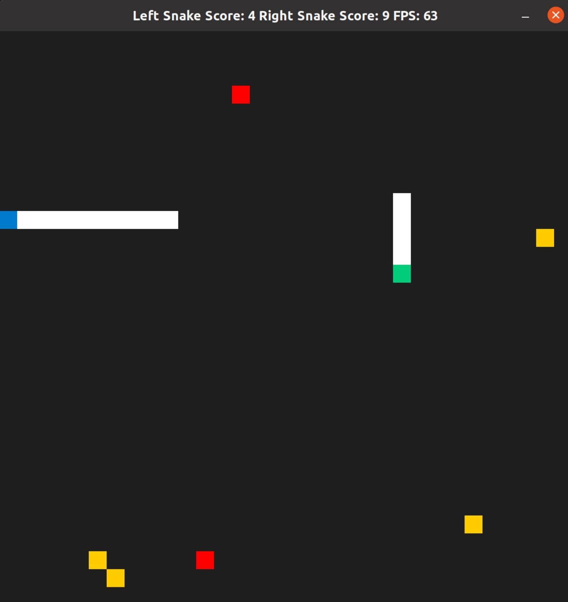

# Capstone Snake Game



The Capstone Project of Udacity's C++ nanodegree is a modified version of the boilerplate game given to the students.

In the current version, a second snake is added to make the game multi-player. In addition to this poison is added to kill the snake that touches it.

## Project structure

```bash
project_folder
├── src  # Contain the main source files of the project 
│	├── main.cpp # The main file used to compile the project
│	├── snake.h # Header for snake class
│	├── snake.cpp # Functions for class that create snake's behaviour
│	├── controller.h # Class that helps to capture user input
│	├── controller.cpp # Contains functions for controller class
│	├── game.h # Game class that helps to run the main game loop
│	├── game.cpp # Functions for game class
│	├── renderer.h # Contains defines class for SDL renderer
│	└── renderer.cpp # Function definitions for renderer class
├── CMakeLists.txt # CMakeList for compiling the project
├── cmake # Folder that contains file(s)
│	└── FindSDL2_image.cmake # cmake file for proper linking of SDL library to the project
├── README.assets # Contains necessary filed for README.md 
├── README.md # The markdown file for explanation of the project
```


## Dependencies for Running Locally
* cmake >= 3.7
  * All OSes: [click here for installation instructions](https://cmake.org/install/)
* make >= 4.1 (Linux, Mac), 3.81 (Windows)
  * Linux: make is installed by default on most Linux distros
  * Mac: [install Xcode command line tools to get make](https://developer.apple.com/xcode/features/)
  * Windows: [Click here for installation instructions](http://gnuwin32.sourceforge.net/packages/make.htm)
* SDL2 >= 2.0
  * All installation instructions can be found [here](https://wiki.libsdl.org/Installation)
  * Note that for Linux, an `apt` or `apt-get` installation is preferred to building from source.
* gcc/g++ >= 5.4
  * Linux: gcc / g++ is installed by default on most Linux distros
  * Mac: same deal as make - [install Xcode command line tools](https://developer.apple.com/xcode/features/)
  * Windows: recommend using [MinGW](http://www.mingw.org/)

## Basic Build Instructions

1. Clone this repo.
2. Make a build directory in the top level directory: `mkdir build && cd build`
3. Compile: `cmake .. && make`
4. Run it: `./SnakeGame`.